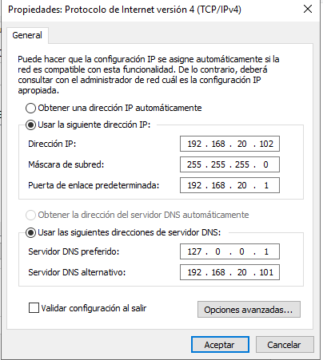
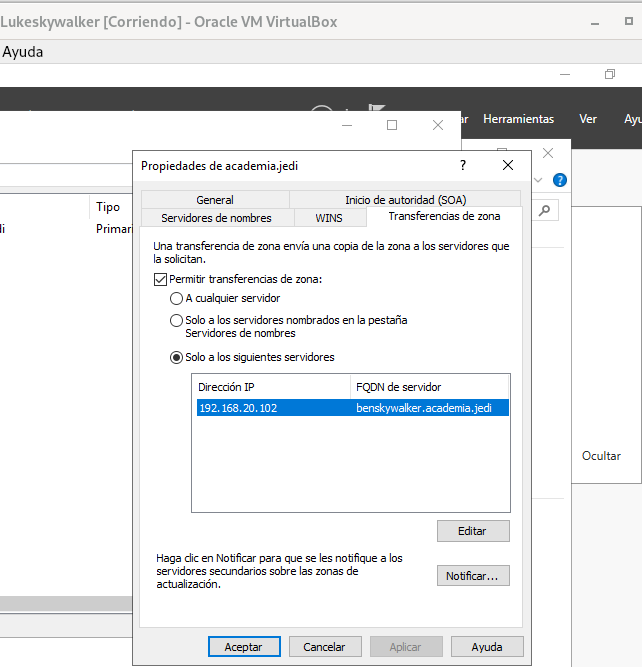
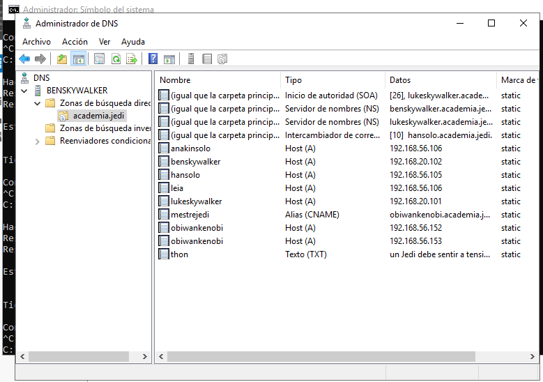
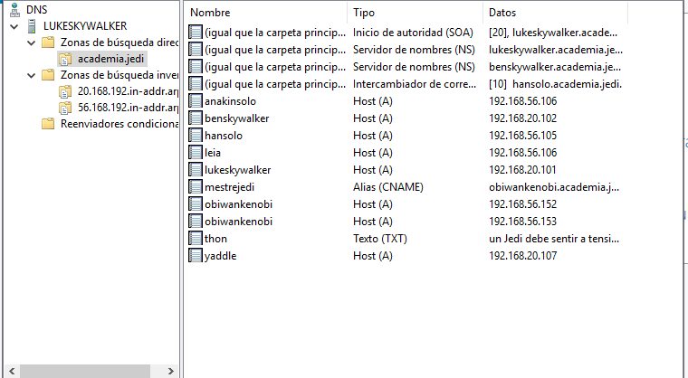
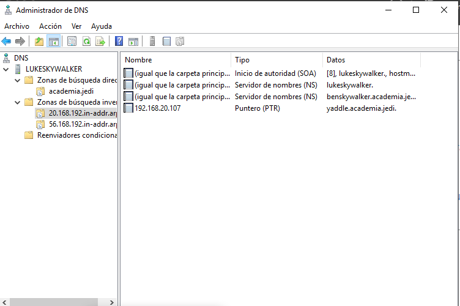
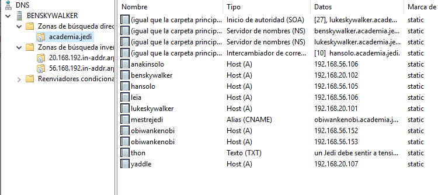
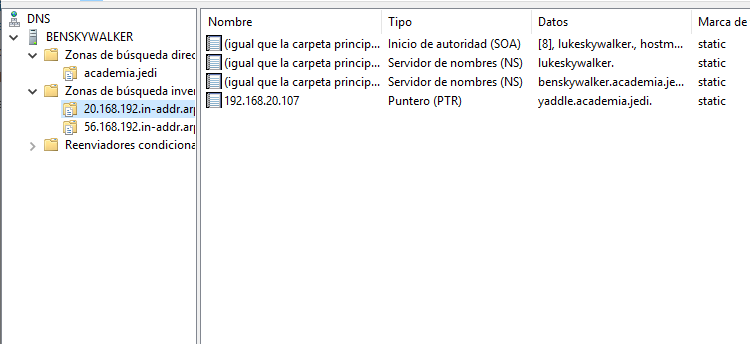

## 1.4 Instalación de zonas secundarias con Windows Server.

 1. Tomaremos a máquina benskywalker, e configuraremola para ser servidor secundario, tanto da zona primaria academia.jedi de resolución directa como de resolución inversa. Captura a configuración en ambalas dúas máquinas.

    -Configuración de BenSkywalker

 

    -Transferencia de zona a Benskywalker

 

    -Comprobación de que se transfirieron
  
 

 2. Engade un rexistro tipo A (yaddle 192.168.20.107) na zona de resolución directa e tamén na de resolución inversa. Adxunta captura dos rexistros da zona unha vez feita a transferencia.

 - Rexistros de zona de Lukeskywalker

 - Rexistros de BenSkywalker

 

 

 **El ultimo y el penultimo punto de la tarea no se pueden realizar por la configuración del VB**