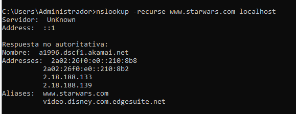
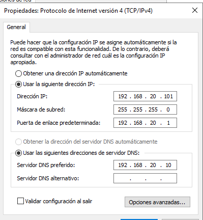
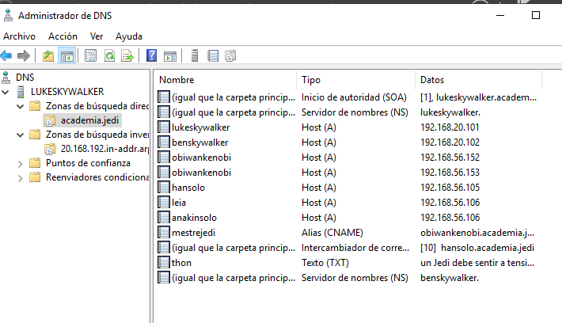
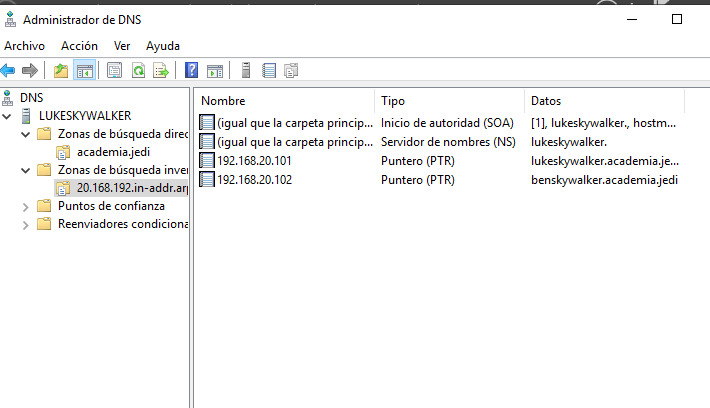
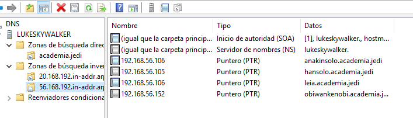
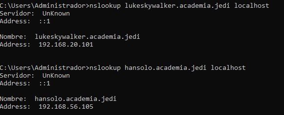
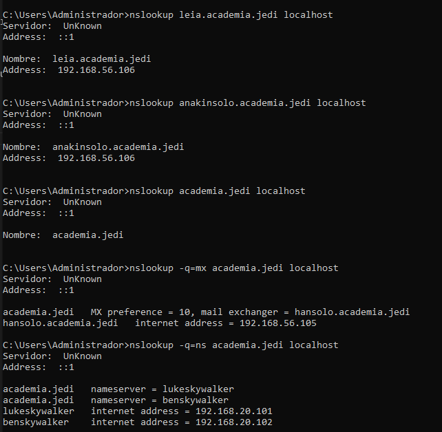
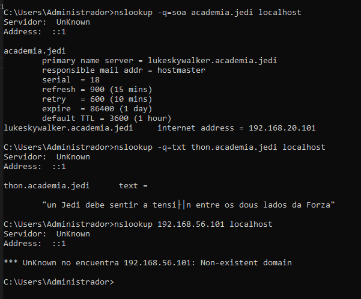

## 1-  Tarefa 1.2

1- Configura o servidor DNS para que empregue como reenviador 8.8.8.8. pegando no documento de entrega a captura de pantalla da configuración do reenviador e a saída deste comando: 

*nslookup -recurse www.starwars.com localhost*

2- Instala unha zona primaria de resolución directa chamada "academia.jedi" e engade os seguintes rexistros de recursos (a maiores dos rexistros NS e SOA imprescindibles):

    -Configuramos la ip estatica:

    - Instalamos la herramienta dns y creamos a zona de busqueda directa:

3- Instala unha zona de resolución inversa que teña que ver co enderezo do equipo lukeskywalker, e engade rexistros PTR para os rexistros tipo A do exercicio anterior. Pega no documento de entrega o a captura dos rexistros da zona.

    - Creamos unha zona de busqueda inversa para o NameServer

4- Comproba que podes resolver os distintos rexistros de recursos. Pega no documento de entrega a saída dos comandos:

