## 1.6 logs + utilidade rndc + nsupdate

1. Fai que no equipo darthvader se faga un log de todas as consultas (/var/log/bind/queries.log) e de todas as actualizacions (/var/log/bind/update.log) a dous ficheiros de log diferentes. Captura a configuración. Amosa as capturas dos dous ficheiros de log, despois de facer consultas e actualizacións e transferencias de zona.

Creamos todo o necesario para que poda facer log executando os seguintes comandos:

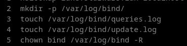

Realizamos varias consultas:

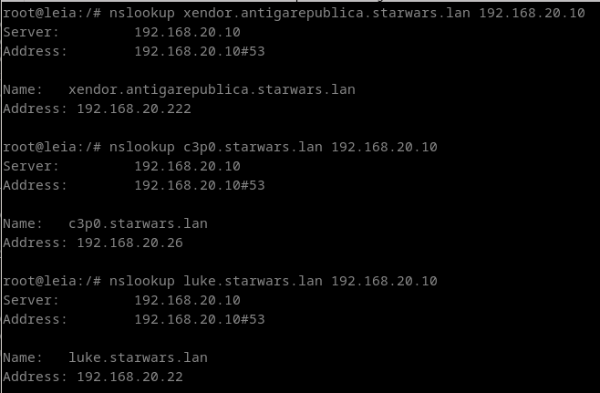

Capturas dos dous ficheiros despois das consultas:

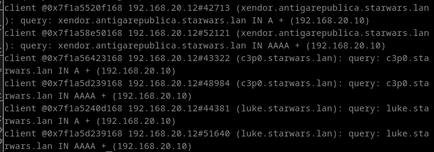

2. Investiga como co comando "dig" podes pedir unha copia dunha zona.

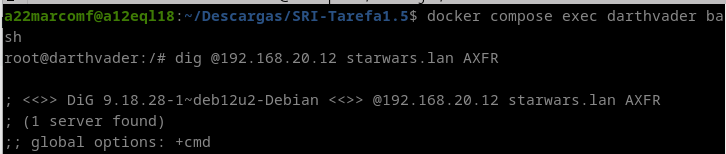

3. Permite que o equipo darthvader poida ser controlado coa utilidade rndc desde un cliente ubuntu ou debian. Fai unha captura do servidor reiniciandose.

Añadimos esto en el apartado de named.conf.options del darthvader.
    
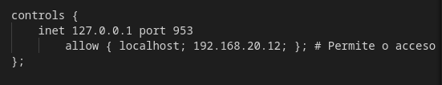

Creamos el rndc.conf dentro de leia

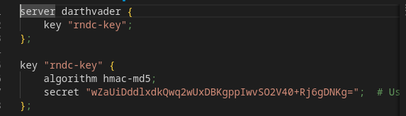

Añadimos este archivo al compose

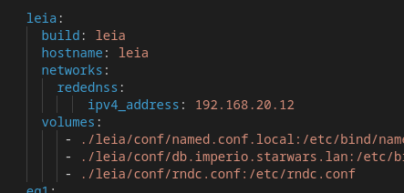

4. Instala unha zona dinámica no servidor darthvader chamada galaxia.lan e introduce os rexistros aaylasecura (192.168.20.239) e yarua (192.168.20.238). Esta zona debe ser cargada mediante rndc, e o servidor reiniciado con rndc. Proba tamén a eliminala con rndc. Inclue capturas do resultado dos comandos, comprobando tamén que se poden facer consultas.

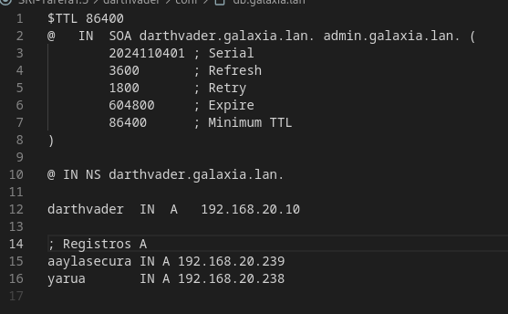

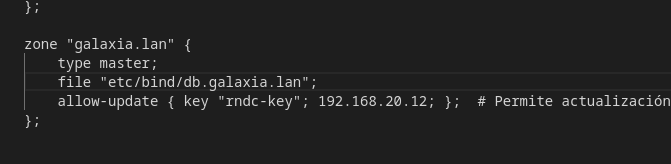

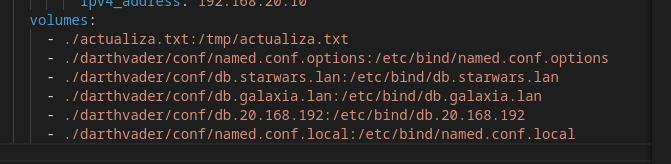

Comprobaciones:
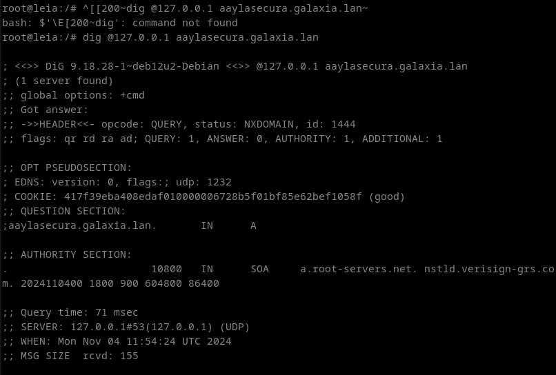

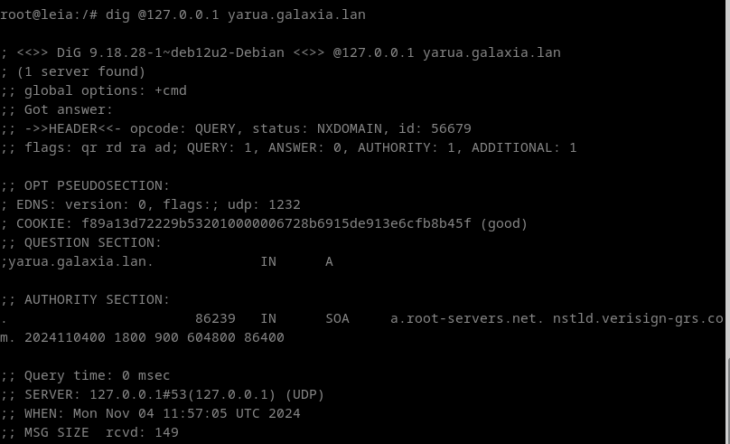

5. Mediante a utilidade nsupdate, engade un rexistro chamado darthmaul (192.168.20.144) á zona starwars.lan empregando chaves

Creamos el archivo actualiza.txt y lo rellenamos con esto:

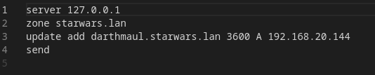

Una vez creado se actualiza con el nsupdate y hacemos la comprobación:

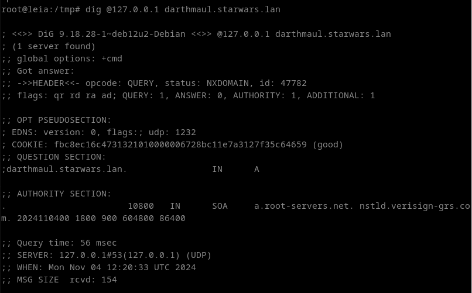
